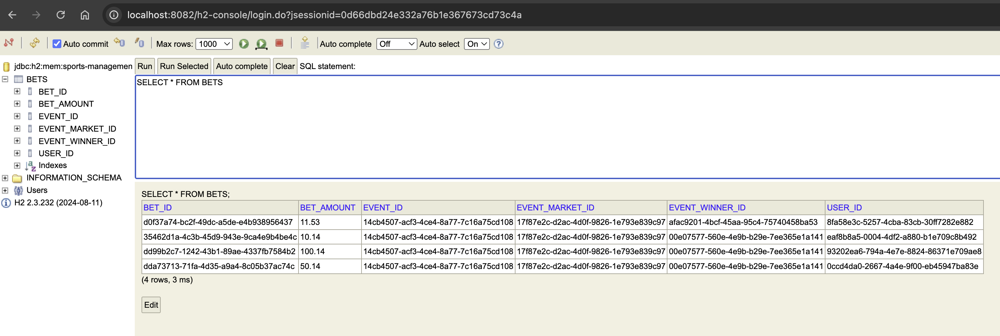

# sporty-group

## Requirements
Your task is to write a backend application that will simulate sports betting event
outcome handling and bet settlement via Kafka and RocketMQ.
* An API endpoint to publish a sports event outcome to Kafka.
* A Kafka consumer that listens to event-outcomes Kafka named-topic.
* Matches the event outcome to bets that need to be settled.
* A RocketMQ producer that sends messages to bet-settlements .
* A RocketMQ Consumer that listens to bet-settlements .

### Run the application
To run the application, you need to have Docker installed and running on your machine.
By running the application it will start a Kafka and RocketMQ server, and the application itself.


## Execution

To run the application, you need do following request:

```bash
curl -X POST --location "http://127.0.0.1:8080/sport-event" \
    -H "Content-Type: application/json" \
    -d '{
          "id": "14cb4507-acf3-4ce4-8a77-7c16a75cd108",
          "name": "ptMEKpJUfQ",
          "winnerId": "afac9201-4bcf-45aa-95c4-75740458ba53"
        }'
```

You could check Persistence on:
http://localhost:8080/h2-console/

Credentials are on application.yaml file




## Troubleshooting
### Spring Boot 3.x.x and RocketMQ
There were an issue with the RocketMQ consumer not being able to consume messages.
As i on this post, the key its import rocketmq autoconfiguration, since a problem with spring boot 3.x.x about
how starters work with autoconfiguration on new versions.
https://github.com/apache/rocketmq-spring/issues/643

### RocketMQ and docker
There is problem running rocketmq on docker, since as similar as kafka it need to run two container one for nameserver and another for broker.
The problem It's that when you do a request nameserver returns the ip of the container of broker, but when you try to connect to it, it's not possible because the ip its internal from docker network. To fix it we use an specific configuration to set the ip of the broker to localhost.

```bash
brokerIP1=127.0.0.1
```

### RocketMQ and topics creation
There is a problem with the auto creation of topics in RocketMQ, so you need modify configuration to allow it.
```bash
autoCreateTopicEnable=true
```
